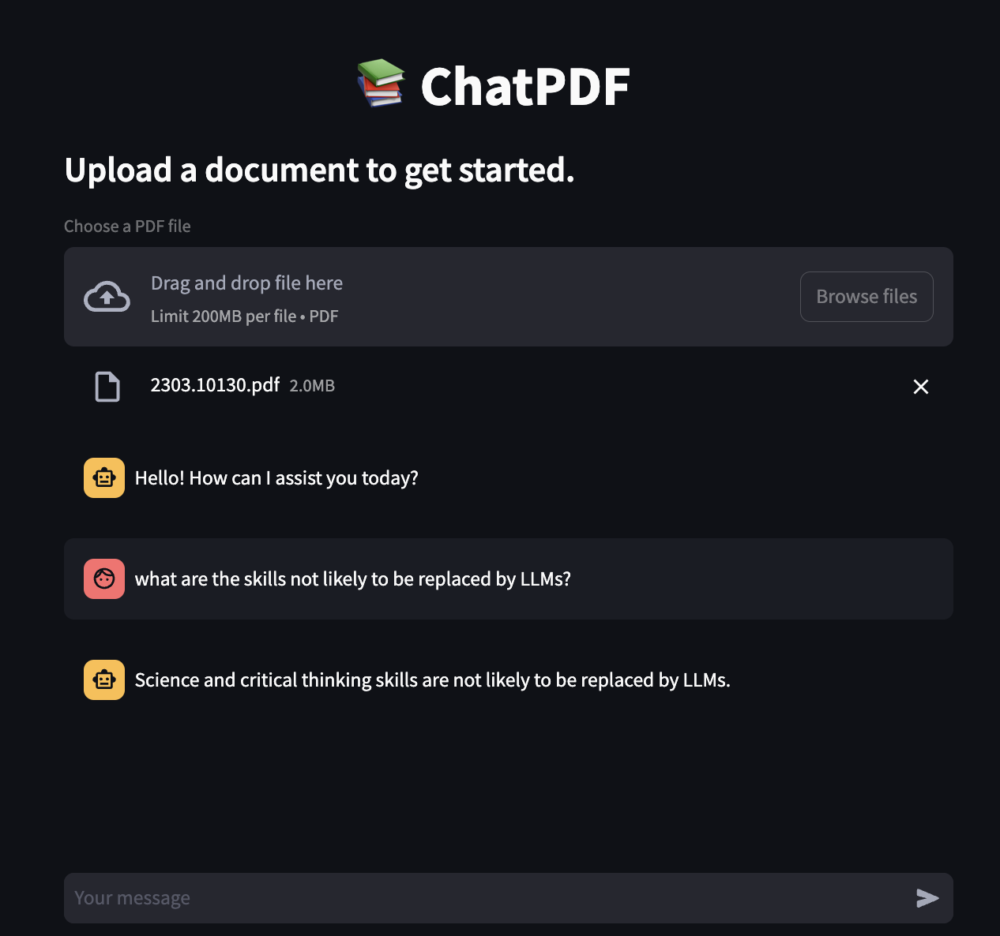

A demo streamlit app to showcase how to highlight text in a PDF. The perfect solution for apps that require to display sources for answers that are generated by LLMs :) 

To run the app, install all the packages in `requirements.txt`

```
pip install -r requirements
``` 

and run the streamlit app via

```
streamlit run app_pdf.py
```

Please see my Medium article for more information! :) 



